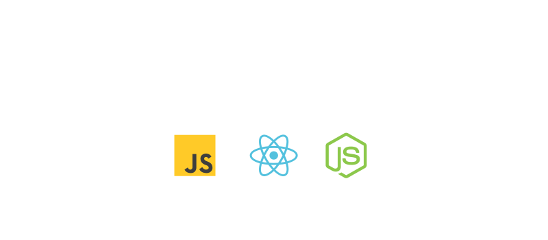

# Hi there, I'm [ younes salimnezhad ] 👋

  JavaScript | React | Node.js Developer

I'm a [Your Role/Title] specializing in [Your Specialization]. Passionate about building impactful projects and continuously learning. Welcome to my GitHub profile!

## 🚀 About Me

- 🔭 I’m currently working on **[Your Project Name](link-to-project)**
- 🌱 I’m currently learning **[Technology/Skill]**
- 💬 Ask me about **[Your Expertise]**
- 📫 How to reach me: **[Your Email]**
- ⚡ Fun fact: **[Something interesting about you]**

## 🛠️ Skills & Tools

### Programming Languages

### Frameworks & Libraries

### Tools & Platforms

## 📈 GitHub Stats

## 🏆 Achievements

- 🥇 **[Achievement 1]**: Brief description.
- 🏅 **[Achievement 2]**: Brief description.
- 🎖 **[Achievement 3]**: Brief description.

## 📚 Featured Projects

### [Project Name 1](link-to-project)
 <!-- Replace with project screenshot -->
- Description: A brief description of what the project does.
- Tech Stack: **[Tech 1]**, **[Tech 2]**, **[Tech 3]**
- [Live Demo](link-to-demo) | [Repository](link-to-repository)

### [Project Name 2](link-to-project)
 <!-- Replace with project screenshot -->
- Description: A brief description of what the project does.
- Tech Stack: **[Tech 1]**, **[Tech 2]**, **[Tech 3]**
- [Live Demo](link-to-demo) | [Repository](link-to-repository)

## 🤝 Connect with Me

## 💡 Fun Facts

- **Hobby:** I enjoy [Your Hobby].
- **Favorite Tech:** I’m a big fan of [Your Favorite Tech].
- **One Line About You:** I [Something Interesting].

---

*Thank you for visiting my profile! Feel free to explore my repositories and connect with me!*

